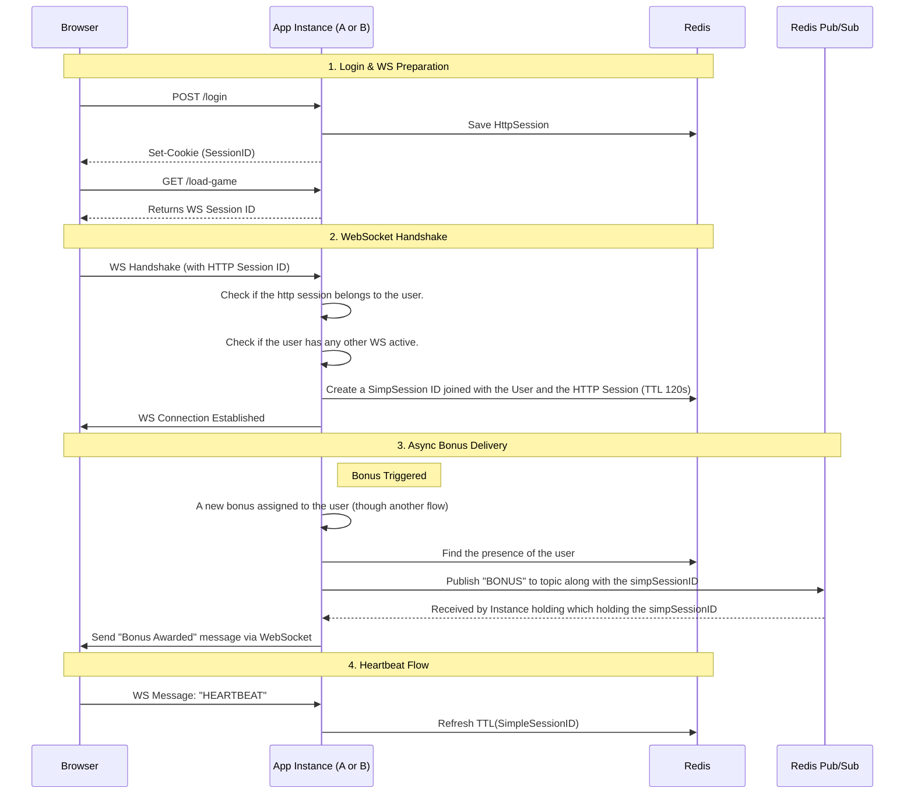

# WebSocket Session Demo (WS-First)



This project demonstrates a **WebSocket-first session model** where:

- Each `/game` uses a HttpSession to communicate with the server.
- WS handshake validates this `HttpSession` and the User that belongs it.
- Presence is tracked per `simpSessionId` with TTL refresh via heartbeat.
- Bonus messages are published via Redis pub/sub to specific `simplSessionId`.

## Quick start

1. Start the app

```bash
./gradlew bootRun
```

2. Open game page

- `http://localhost:8080/game`
- Click `Connect` to open WebSocket.

3. Trigger a bonus for the same user

```bash
curl -i -X POST "http://localhost:8080/v1/bonus" \
  -H "Content-Type: application/json" \
  -d '{"user":"user0","bonusId":"b1"}'
```

